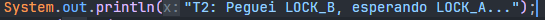

# Relatório: Análises de DeadLock

**Aluno:** João Vitor Correa Oliveira e Eduardo Fabri
**Matéria:** Performance de Sistemas Ciberfisícos

---

### 1. Objetivo

Reproduzir o **deadlock**, explicar quais condições de **Coffman** se manifestaram e implementar uma **correção**

---

### Código: `DeadLockDemo.java`

```java
import java.util.concurrent.*;

public class DeadlockDemo {
                                    //monitor
    static final Object LOCK_A = new Object();
    static final Object LOCK_B = new Object();

    public static void main(String[] args) {
        Thread t1 = new Thread(() -> {
            //trava
            synchronized (LOCK_A) {
                System.out.println("T1: Peguei LOCK_A, esperando LOCK_B...");
                dormir(50);
                synchronized (LOCK_B) {
                    System.out.println("T1 concluiu");
                }
            }
        });

        Thread t2 = new Thread(() -> {
            //trava
            synchronized (LOCK_B) {
                System.out.println("T2: Peguei LOCK_B, esperando LOCK_A...");
                dormir(50);
                synchronized (LOCK_A) {
                    System.out.println("T2 concluiu");
                }
            }
        });

        t1.start();
        t2.start();
        System.out.println("Sistema iniciado. Aguardando conclusão...");
    }
    //causa o conflito de tempo
    static void dormir(long ms) {
        try {
            Thread.sleep(ms);
        } catch (InterruptedException e) {
            Thread.currentThread().interrupt();
        }
    }
}
```

Bom, neste código ele esta forçando um deadlock, como o professor especificou, a única diferenca são os dois outputs, que evidenciam os logs de aquisição e o travamento observado:

  

### 2. Análise do travemento: Diante das condições de Coffman

Percebemos que o programa trava infinitamente após as threads imprimirem suas entradas, os logs acima. Isso ocorreu pois os quatro indicadores para ocorrer um DeadLock foram satisfeitas.

1. Exclusão mútua ou mutex, mesma coisa que ocorreu no semaphore, porém neste caso os bloco syncrhonized garantem que apenas uma thread pode "possuir" um lock (`LOCK_A` ou `LOCK_B`) por vez.
2. Manter  e esperar. A **T1** mantém o **lock_A** enquanto o espera pelo **lock_b**, da mesma maneira que o t2 mantém o **lock_b** esperando pelo **lock_a**, Simultaneamente.
3. Não preempção. O **lock** não pode ser preemptado, ou ser tomado via força bruta. A **t1** deve liberar o **lock_a** voluntariamente, ação que ela só vai efetuar após obter o lock_b
4. Espera circular. Igualmente na atividade 1, no ***Jantar dos filosofos**,* neste caso há uma espera de recursos por ambas as partes, ou seja, é a condição fatal que resulta nas outras 3, **T1** espera por **T2** para liberar o **lock_b**, enquanto o **T2** espera o **T1** para liberar o **lock_a**


# 3. Experimento 2: Corrigindo o Deadlock


*Eduardin boi


# Conclusão

#### *Mini texto*
